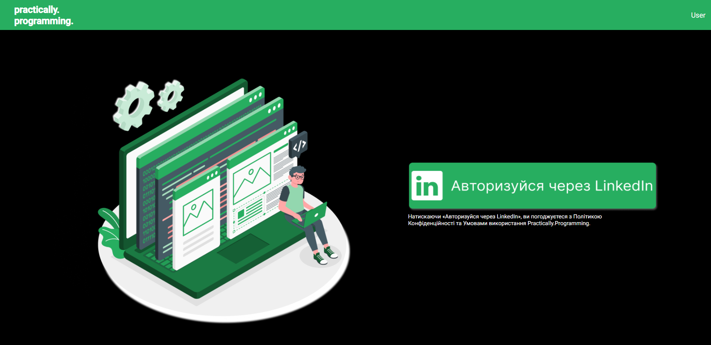
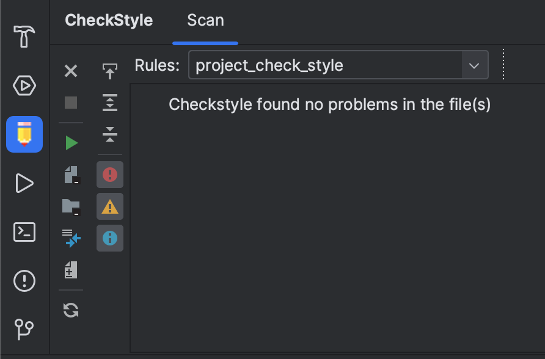

<h1 align="center">Practic</h1>

### ⚡Інформація про проєкт

В цьому репозиторії можна побачити реалізацію сайту - збірнику курсів,
де адміністратори можуть додавати курси, ментори ними управляти та змінювати,
а студенти просто навчатися, отримувати знання, готувати доповіді
та робити практичні роботи.



В проєкті використані такі технології:
-	Spring Boot 3, Spring Security, Spring Data, Hibernate;
-	PostgreSQL;
-	Angular 16.2+;
-	Реєстрація та авторизація відбуваються за допомогою LinkedIn, використовуючи OAuth 2.0 та JWT;

Проєкт Practic складається з 3х модулів:
1.	Модуль practic - бекенд з використанням Spring Boot 3;
2.	Модуль frontend - фронтенд на Angular 2+;
3.	Модуль loadTesting - тести з використанням Gatling;
      
Проєкт має налаштовану перевірку стилю кода, файли з налаштуваннями ggogle_cheks.xml, suppresions.xml (відключення перевірки Javadoc).

### ⚙ Налаштування і запуск проекту️

Для роботи сервісу необхідно:
1.	git clone - клонувати проєкт;
2.	встановити node.js (не нижче версії 16.20 LTS);
3.  встановити ряд необхідних зміних (найкращий спосіб – застосувати environment variables):
- _LINKEDIN_CI_ - LinkedIn Client ID - ключ аутентифікації, який можна знайти в аппці на лінкедіні;
- _LINKEDIN_CS_ - LinkedIn Client Secret - пароль до ключа аутентифікації, який можна знайти в аппці на лінкедіні (зверніться до колег);
- _LOGOUT_REDIRECT_URI_=http://localhost:4200/login?logout=true - (приклад для локального використання);
- _MAIL_PASSWORD_ - пароль до пошти, що буде використана для відправки нотифікацій з приводу нових доповідей;
- _MAIL_USERNAME_ - пошта, що буде використана для відправки нотифікацій з приводу нових доповідей;
- _POSTGRESQL_PASSWORD_ - пароль до postgresql бази даних, що використовується для роботи програми (локальний);
- _POSTGRESQL_URL_ - url до бази даних, що використовується для роботи програми (локальний);
- _POSTGRESQL_USERNAME_ - username користувача, що використовує базу даних (локальний);
- _REDIRECT_URI_=http://localhost:4200/oauth2/redirect,   myandroidapp://oauth2/redirect, myiosapp://oauth2/redirect - (приклад для локального використання);
- _TOKEN_SECRET_ - токен, що буде використовуватися в програмі для JWT (16-річне число, seed, який буде використаний для генерації токену);

*Слід зазначити, що при роботі на віддаленому сервері, всі "localhost:порт" треба замінити на домен сервера, наприклад: http://localhost:4200/login?logout=true -> https://<ваш домен>/login?logout=true

4.	імпортувати файл google_cheks.xml (файл знаходиться в корені проекту): зайти в Settings  Tools  Checkstyle. Далі в Configuration file додати файл google_cheks.xml і поставити галочку на Active. Checkstyle version має бути > 10 (напр. 10.12.5).
      В Idea в закладці  Checkstyle обрати в Rules той файл, який внесено в Tools.
<p align="center">

</p>

5.	перейти в frontend/src/main/angular (папка, де знаходиться package.json) та запустити ```npm install``` (за необхідності запустити ```npm update```);

6.	зробити першу збірку проєкту ```npm ci``` (або - ```npm clean install```) – щоб створився build.properties в маніфесті;

7.	перейти в корінь проекту і зібрати весь проект - ```mvn clean install```;

8.	запуск фронтенду та бекенду:
-	фронтенд запускається з папки проекту (папка frontend) –  npm start (по замовчуванню запускається сервер http://localhost:4200/);
-	для запуску бекенду запустити метод main в PracticApplication (до команди npm start дописаний проксі сервер для запитів на бекенд за адресою http://localhost:5001/).
     
Після збірки і запуску додатку фронтенд і бекенд працють на одному сервері: http://localhost:5001/

Для того щоб задеплоїти програму на продакшин треба внести зміни в файлі environment.prod.ts, що знаходиться в папці frontend/src/main/angular/src/environments.

### ⚡Створення інстанса для проєкта
### ⚙ Порядок виконання дій:
1. AWS створюється пара ключів
   - secrets.AWS_ACCESS_KEY_ID
   - secrets.AWS_SECRET_ACCESS_KEY
2. На Github у налаштуваннях безкеки поточного проєкту треба встановити ці ключі з AWS.

3. на AWS EB(Elastic Beanstalk) 
   - створити новий Enviroment (example) _*shpp-develop*_, який автоматично для даного enviroment створить:
     -  new _*Applcation*_
     -  new _*Instance EC2*_ 
   
4. EB -> enviroment _*shpp-develop-env*_ -> Configuration встановити усі необхідні ключі-значення:
   -  GRADLE_HOME
   - LINKEDIN_CI 
   - LINKEDIN_CS 
   - LOGOUT_REDIRECT_URI 
   - M2 
   - M2_HOME 
   - MAIL_PASSWORD 
   - MAIL_USERNAME 
   - POSTGRESQL_PASSWORD 
   - POSTGRESQL_URL 
   - POSTGRESQL_USERNAME 
   - REDIRECT_URI 
   - TOKEN_SECRET
5. за шляхом -> 
>   _*frontend/src/main/angular/src/enviroments/*_

лежать усі налаштування та редіректи шляхів для наших інстансів: _*prodaction*_ та _*localhost*_ у файлах _*enviroment...ts*_
  - Створюємо новий _*enviroment.develop.ts*_
    - в середині файлу встановлюємо шляхи для для _*enviroment.develop.ts*_ аналогічні шляхам файлу _*enviroment.prod.ts*_, але замість продакшн інстанса EC2 встановлюємо шляхи нашого інстанса для розробки _*shpp-development*_
6. у файлі за шляхом _*frontend/src/main/angular/angular.json*_   
      >"configurations": {...}
   > 
   налаштувати шлях до файлів _*enviroment.ts..*_

   назва налаштування має співпадати з конкретним файлом enviroment, у нашому випадку це _*develop*_
      
   > "develop": {
   "budgets": [
   {
   "type": "initial",
   "maximumWarning": "500kb",
   "maximumError": "3mb"
   },
   {
   "type": "anyComponentStyle",
   "maximumWarning": "2kb",
   "maximumError": "4kb"
   }
   ],
   "fileReplacements": [
   {
   >>"replace": "src/enviroments/enviroment.ts",
   >>"with": "src/enviroments/enviroment.develop.ts"
   > 
   > }
    ],
   "outputHashing": "all" },

7. у модулі _*frontend/pom.xml*_ створити новий _*profile:*_
   
   > < id >- develop-build-< /id >
    
      > < configuration >
   < arguments > run build -- --configuration=shpp-develop < /arguments > < /configuration >
      

8. Локально на проекті за шляшом ->
>_*/.github/workflows/ файли .yml*_ 
> 
налаштувати шлях до гілки з якої буде робитись деплой проєкта, прописавши потрібну гілку

> push:     
>     branches: development

далі у цьому ж файлі прописати _*application*_ та _*enviroment*_ нашого EB
> application_name: 'Shpp-development'
> 
> environment_name: 'Shpp-development-env'

9. у профілі Linkedin додати редірект вашого інстансу (example) 
> http:// назва інстанса .eu-north-1.elasticbeanstalk.com
